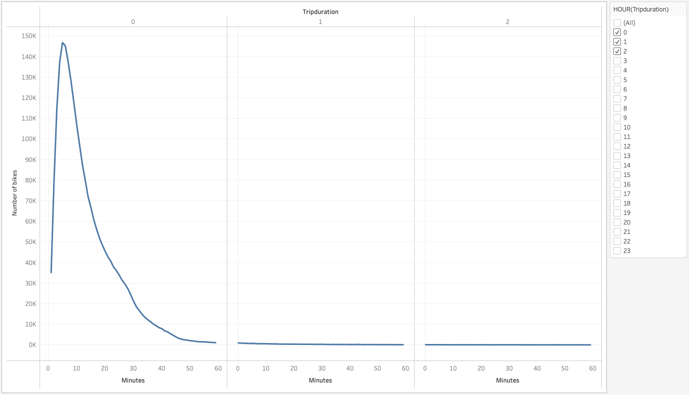
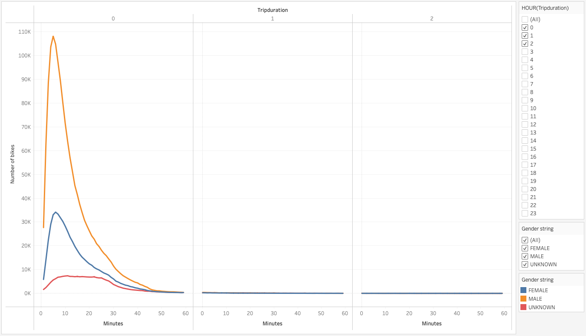
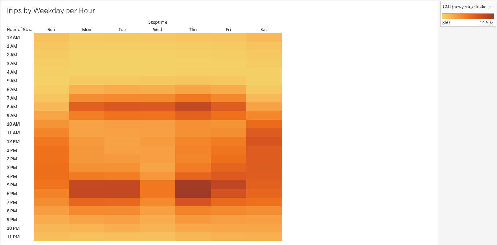
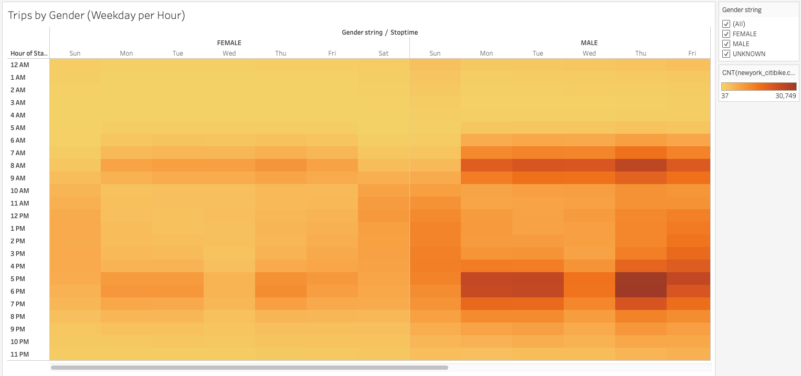
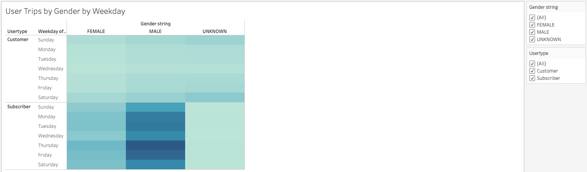
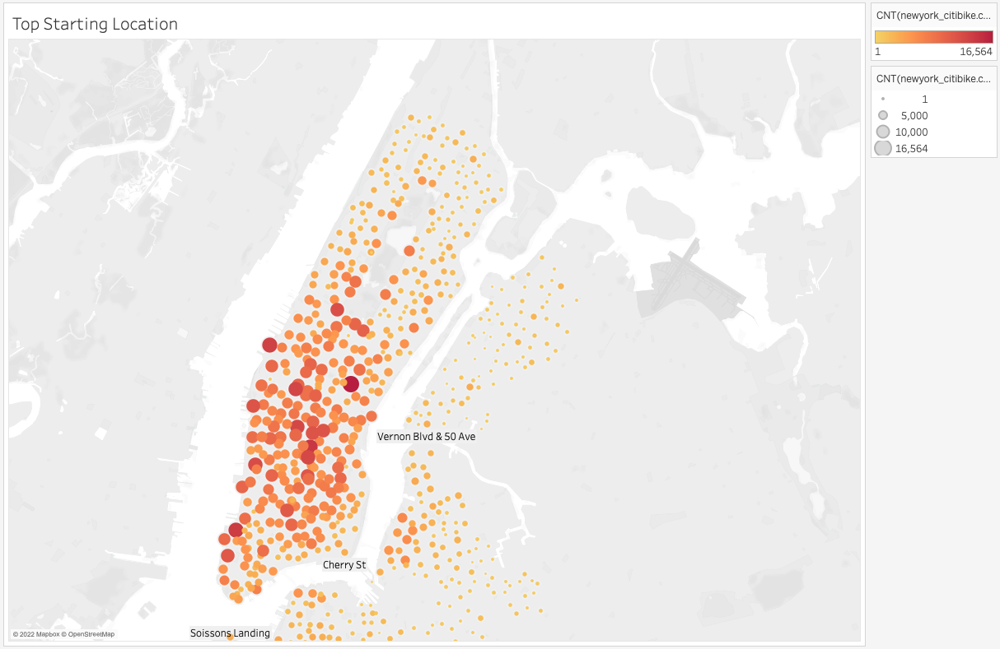
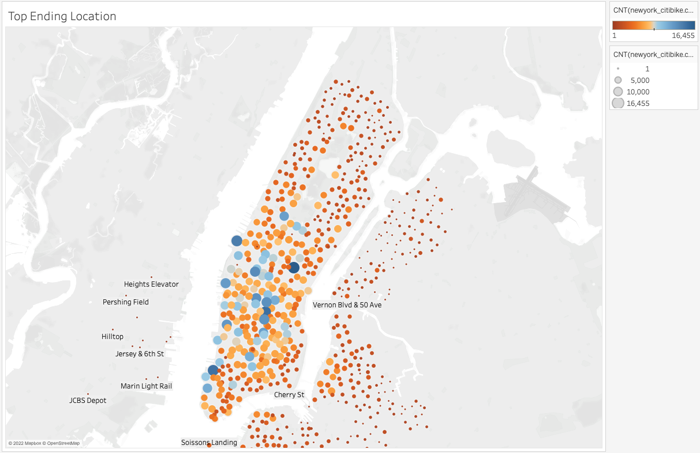

# Bikesharing
## Overview of the analysis:

The purpose of this project is to demonstrate investors how the bike-sharing services of NYC works, so that they could make a decision to implement this model or not. 

To view the story click [HERE](https://public.tableau.com/app/profile/sharof7350/viz/NewYork_Citibike_Challenge_16607694113240/NewYorkCitibike-Dashboard?publish=yes).

## Results: 
### Checkout times for users:

The majority of users check out between the first twenty minutes. This information tell us that the system would need to invest in high quantity if bikes to cover the demand. On the other hand, it could result in less repairs as trips are short.

### Checkout times by Gender:

Male riders are the primary user of the bike share program making up 65% of the population, with the remaining being 25% female and 10% unknown.

### Trips by Weekday per hour:

During the weekdays, the trend shows us that people use the service to commute to and from work; however after work is when they used it more. Saturday is also the stronger day for bike users during the weekend.

### Trips by Gender (Weekday per Hour):

Male riders are more inclined to use the bike sharing program to commute to and from work, as well as during the weekend.

### User Trips by Gender by Weekday:

Males seem to rely on the system for their transportation as most are subscribers. Most users of the system are subscribers, using it weekdays. Non-subscribers use it more during the weekend.

### Top Starting Location:

The following places are popular for Citibike customers to begin their journeys in New York City are:
- Pershing Square
- Broadway
- Tribecca Bridge
  
### Top Ending Location:

The most popular places for Citibike customers to end their journeys in New York City are as follows:
- Pershing Square
- Broadway
- Tribecca Bridge
  
## Summary: 
The data shows high activity of the bike sharing service in New York during the month of August 2019.
The majority of the rides were in the very busy Manhattan Island, taken by male users during morning and evening rush hours. 
